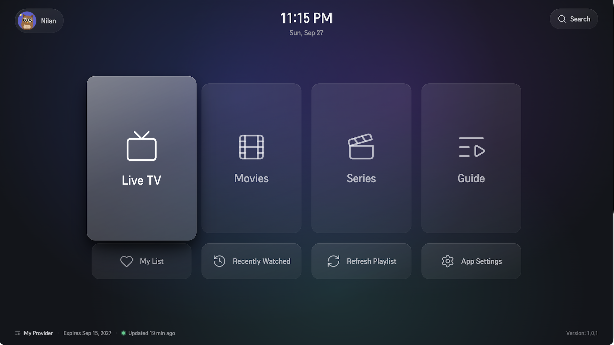
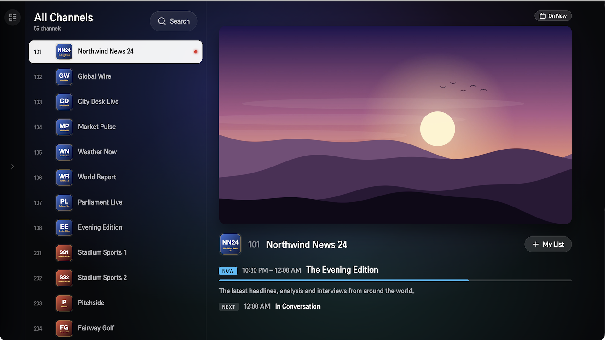
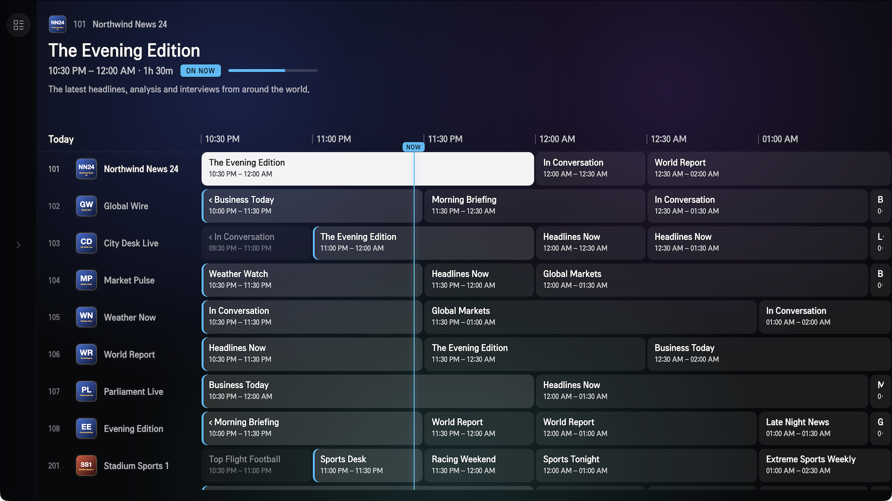
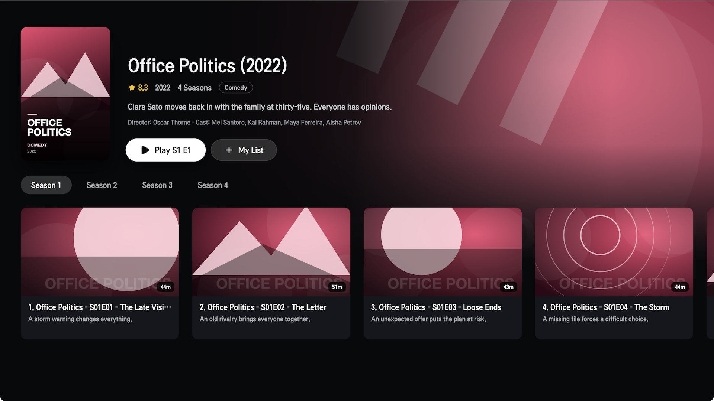
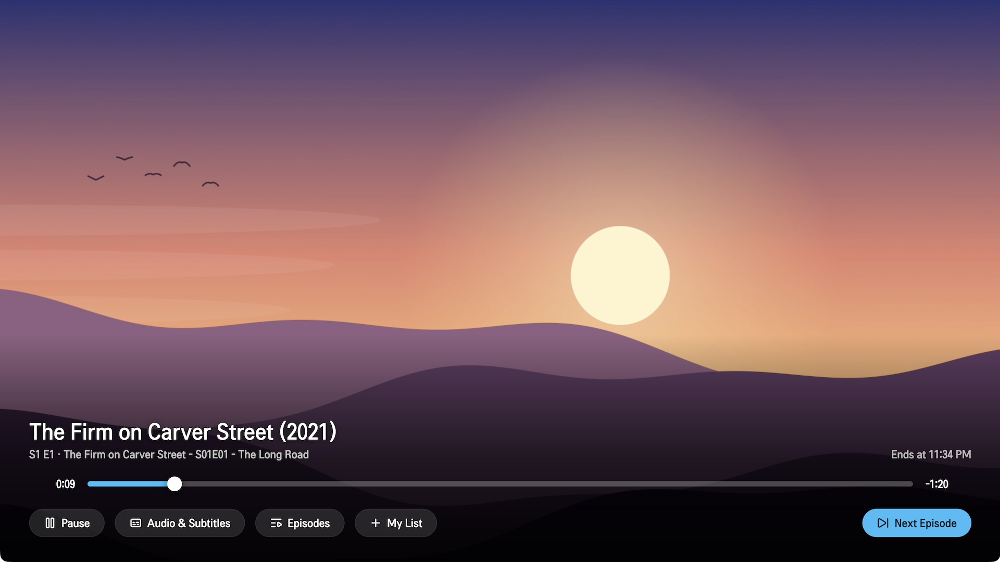
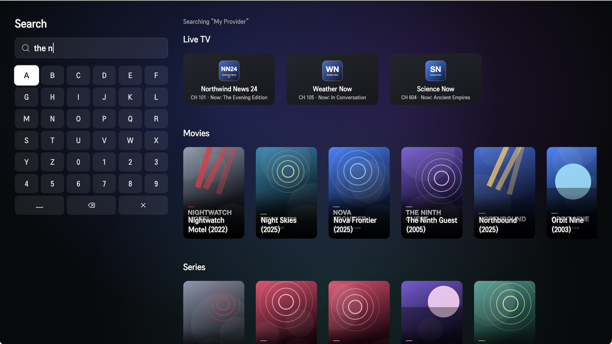
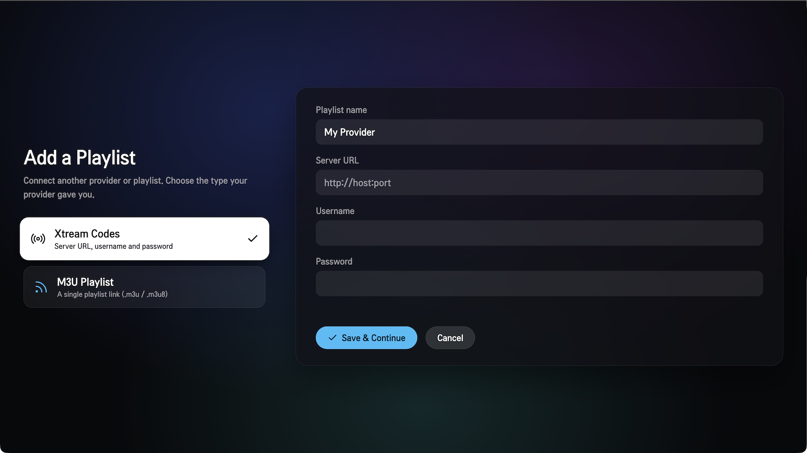

<p align="center">
  
</p>

<h1 align="center">ZenPlay</h1>

<p align="center">
  A fast, remote-friendly IPTV player for <strong>LG webOS TV</strong>, built with React, TypeScript and hls.js.
</p>

<p align="center">
  <a href="https://github.com/nilandev/zenplay/actions/workflows/ci.yml"></a>
  <a href="LICENSE"></a>
  
  <a href="CONTRIBUTING.md"></a>
</p>

---

ZenPlay plays Live TV, movies and series from **your own** Xtream Codes
account or M3U playlist. It is designed from the ground up for the TV
remote: every screen works with the D-pad alone, channel switching is
pre-warmed, and the whole UI is built around a spatial-navigation focus
system rather than mouse hover.

> **ZenPlay does not provide any content.** It ships with no channels,
> playlists, providers or credentials. You are responsible for making sure
> you have the rights to any streams you load into it.

## Screenshots

<p align="center">
  
  <br />
  <em>Home: everything one press away, with the playlist's expiry and last update at the bottom.</em>
</p>

<table>
  <tr>
    <td width="50%" valign="top">
      
      <p align="center"><strong>Live TV</strong><br />Channel list with a live preview and what's on now and next.</p>
    </td>
    <td width="50%" valign="top">
      
      <p align="center"><strong>TV Guide</strong><br />A full EPG grid, with catch-up on supported channels.</p>
    </td>
  </tr>
  <tr>
    <td width="50%" valign="top">
      
      <p align="center"><strong>Series</strong><br />Details, seasons and episodes at a glance.</p>
    </td>
    <td width="50%" valign="top">
      
      <p align="center"><strong>Player</strong><br />Audio and subtitle tracks, an episodes panel and Next Episode.</p>
    </td>
  </tr>
  <tr>
    <td width="50%" valign="top">
      
      <p align="center"><strong>Search</strong><br />One search across channels, movies and series, typed with the remote.</p>
    </td>
    <td width="50%" valign="top">
      
      <p align="center"><strong>Add a playlist</strong><br />Xtream Codes login or an M3U link.</p>
    </td>
  </tr>
</table>

<sub>Screenshots use invented demo data from the bundled <a href="mock-xtream/">mock Xtream server</a>: no real channels, titles or artwork.</sub>

## Features

- **Live TV** – category rail, channel list with a live preview and
  now/next info, and favourites.
- **EPG guide** – XMLTV programme guide with now/next info and
  catch-up/timeshift playback on supported channels.
- **Movies & series** – Apple TV–style shelves with animated backdrops,
  season and episode browsing, and an in-player episodes panel.
- **Favourites & history** – quick access to saved channels, movies and
  series, plus a watch history.
- **Multiple sources** – Xtream Codes login or M3U playlist URL; manage
  several playlists side by side.
- **Profiles & parental controls** – multiple profiles with avatars and
  PIN-locked categories.
- **Offline-friendly caching** – catalogue data is stored in IndexedDB and
  synced in a web worker, with skeleton loaders instead of blank screens.
- **Built for the remote** – full 5-way/D-pad navigation, webOS back-key
  handling and media-key support.

## Requirements

| Tool | Version |
| --- | --- |
| [Node.js](https://nodejs.org/) | 20 or newer |
| [pnpm](https://pnpm.io/) | 9 or newer |
| [webOS TV CLI](https://webostv.developer.lge.com/develop/tools/cli-installation) (`ares-*`) | Only needed to package/install on a TV or the Simulator |

**Target devices:** LG TVs running webOS TV 6.0 or newer (2021+ models,
Chromium 79+). Older webOS versions are not supported.

## Quick start

```bash
git clone https://github.com/nilandev/zenplay.git
cd zenplay
pnpm install
pnpm dev
```

Open <http://localhost:5173> in a desktop browser. The arrow keys act as
the remote's D-pad, `Enter` selects and `Escape` goes back. Add your own
Xtream Codes account or M3U URL on the "Add source" screen.

To try everything without a provider, run the bundled
[mock Xtream server](mock-xtream/) (`pnpm mock:xtream`) and add
`http://localhost:8787` with username and password `demo`: it serves an
invented catalogue with channels, a TV guide, movies and series.

For a quick playback check, you can also use a public HLS test stream such
as `https://test-streams.mux.dev/x36xhzz/x36xhzz.m3u8`.

> **About CORS in development:** most IPTV providers don't send CORS
> headers, so a browser would normally block requests to them. The dev
> server includes a small proxy (`vite-dev-proxy.ts`) that forwards these
> requests for you. It only exists in `pnpm dev` and is not included in
> production builds; the webOS runtime doesn't need it.

## Running on an LG TV

1. Install the [webOS TV CLI](https://webostv.developer.lge.com/develop/tools/cli-installation).
   The [webOS TV Simulator](https://webostv.developer.lge.com/develop/tools/simulator-installation)
   is optional but handy.
2. Enable **Developer Mode** on your TV (install the "Developer Mode" app
   from the LG Content Store, sign in, turn it on and note the IP address).
3. Register the TV with the CLI:

   ```bash
   ares-setup-device --add myTV --info "host=<TV_IP>" --info "port=9922" --info "username=prisoner"
   ```

4. Build, package, install and launch:

   ```bash
   pnpm package              # builds and creates an .ipk in webos-dist/
   pnpm install-device myTV  # installs the .ipk on the TV
   pnpm launch-device myTV   # launches the app
   ```

The device name is a plain trailing argument (`pnpm launch-device myTV`,
not `--device=myTV`).

**Using the Simulator:** either drag the built `dist/` folder (not
`webos-dist/`) onto the Simulator window, or register it as a device
(`host=127.0.0.1`, `port=6622`, `username=developer`) and use the same
commands as above.

**Debugging on device:** `pnpm inspect-device myTV` opens remote DevTools.

> **Forking?** Change the `id` in `webos-meta/appinfo.json` (currently
> `com.spannable.zenplay`) and the matching ID in the `launch-device` and
> `inspect-device` scripts in `package.json`, so your build installs as a
> separate app.

## Scripts

| Command | What it does |
| --- | --- |
| `pnpm dev` | Start the Vite dev server with the CORS proxy |
| `pnpm build` | Production build into `dist/`, including webOS metadata |
| `pnpm preview` | Serve the production build locally |
| `pnpm typecheck` | Run the TypeScript compiler without emitting |
| `pnpm test` | Run the unit test suite (Vitest) |
| `pnpm package` | Build and package an `.ipk` into `webos-dist/` |
| `pnpm install-device <name>` | Install the packaged app on a registered device |
| `pnpm launch-device <name>` | Launch the installed app |
| `pnpm launch-hosted <name>` | Run `dist/` on the device without packaging |
| `pnpm inspect-device <name>` | Open remote DevTools for the running app |

## Project structure

ZenPlay is a single package with a flat layout. `@core`, `@player` and
`@ui` are path aliases (see `tsconfig.json` and `vite.config.ts`), not
separate npm packages.

```text
src/
├── core/        # @core: Xtream client, M3U & XMLTV parsers, models, storage, remote keymap
├── player/      # @player: hls.js playback engine
├── ui/          # @ui: spatial-navigation focus system and shared components
├── screens/     # App screens: home, live TV, guide, movies, series, settings…
├── workers/     # Web worker for background catalogue sync
└── App.tsx      # App shell and routing
public/          # Static assets (brand artwork, avatars, backgrounds)
webos-meta/      # appinfo.json and icons, copied into dist/ on build
scripts/         # Build and device-install helpers
```

## Tech stack

- [React 18](https://react.dev/) + [TypeScript](https://www.typescriptlang.org/)
- [Vite](https://vitejs.dev/) for dev server and builds
- [hls.js](https://github.com/video-dev/hls.js) on top of the TV's hardware-accelerated `<video>`/MSE
- [Zustand](https://github.com/pmndrs/zustand) for state
- [Vitest](https://vitest.dev/) + [Testing Library](https://testing-library.com/) for tests

## Roadmap

- [ ] Validation across more real LG TV models
- [ ] Final app icon and splash artwork
- [ ] Performance tuning for `backdrop-filter` on lower-end TV GPUs
- [ ] Other platforms (Android TV, Samsung Tizen, desktop, mobile) – not planned yet

Have an idea? [Open an issue](https://github.com/nilandev/zenplay/issues/new/choose).

## Contributing

Contributions are welcome, whether that's a bug report, a device test
report or a pull request. Please read [CONTRIBUTING.md](CONTRIBUTING.md)
before you start, and follow our [Code of Conduct](CODE_OF_CONDUCT.md).

To report a security issue, please follow [SECURITY.md](SECURITY.md)
instead of opening a public issue.

## Disclaimer

ZenPlay is a general-purpose media player. It does not host, provide,
link to or promote any content. The authors do not endorse the use of
this software to access content you do not have the rights to view.

"LG" and "webOS" are trademarks of LG Electronics. This project is not
affiliated with or endorsed by LG Electronics.

## License

[MIT](LICENSE) © ZenPlay contributors
